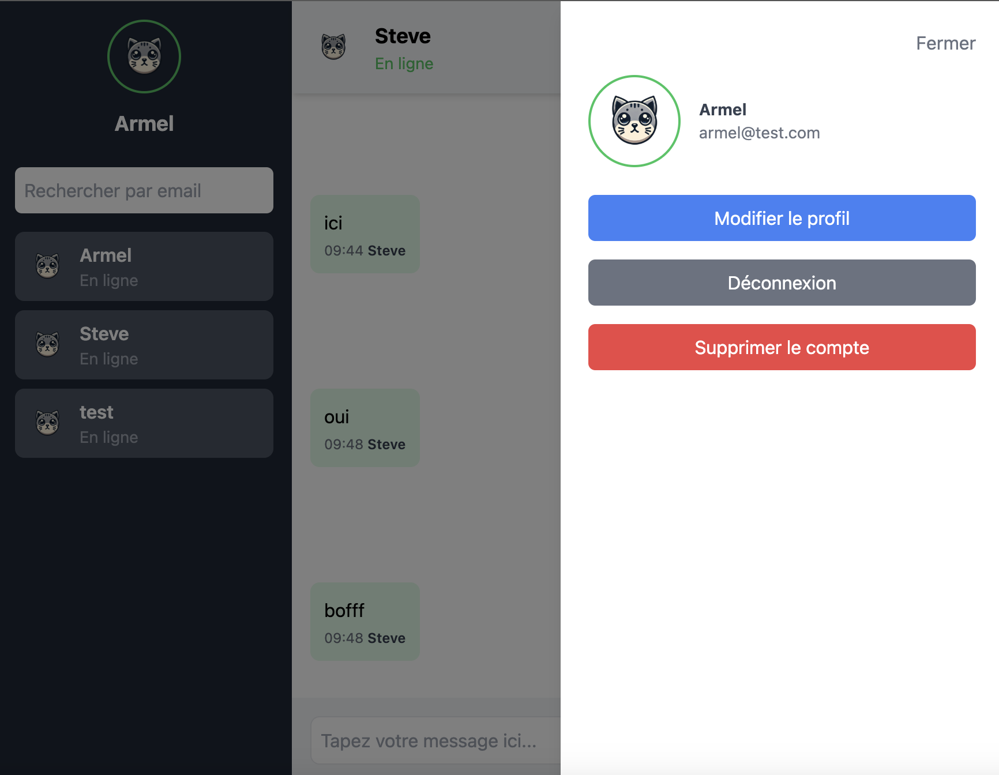

Here’s a finalized `README.md` for your project, with the image placed in the `public` directory:

---

# **React Chat Application**

A real-time chat application built with **React**, **Socket.IO**, and a RESTful API backend. This project features an intuitive user interface, user session management, and real-time messaging.

---

## **Overview**

Here is a screenshot of the application:



---

## **Key Features**

- User authentication (Sign Up, Login, Logout)
- Real-time messaging with Socket.IO
- User profile management with update and delete functionalities
- Search and select users to start a conversation
- Modern and responsive user interface

---

## **Prerequisites**

Before starting, ensure you have the following installed on your machine:

- **Node.js** (version 16 or higher)
- **npm** or **yarn** (package manager)

---

## **Setup Instructions**

### Frontend Setup

1. **Clone the repository**:
   ```bash
   git clone https://github.com/Armelsteve1/reactjsChat.git
   cd reactjsChat
   ```

2. **Install dependencies**:
   ```bash
   npm install
   # or
   yarn install
   ```

3. **Create a `.env` file** at the root of the project:
   ```bash
   VITE_API_BASE_URL=http://localhost:3000
   ```

4. **Run the application in development mode**:
   ```bash
   npm run dev
   # or
   yarn dev
   ```

   The application will be available at [http://localhost:5173](http://localhost:5173).

---

### Backend Setup

To fully run the application, you need to clone and set up the backend.

1. **Clone the backend repository**:
   ```bash
   git clone https://github.com/Armelsteve1/nestchat.git
   cd nestchat
   ```

2. **Follow the instructions in the backend's `README.md`** to configure and run it.

3. Make sure the backend is running at the URL defined in the `.env` file of the frontend (default: `http://localhost:3000`).

---

## **Project Structure**

Here’s an overview of the main files and directories:

```
src/
├── components/
│   ├── Auth/
│   │   ├── Login.jsx
│   │   ├── Register.jsx
│   ├── ChatComponents/
│   │   ├── Sidebar.jsx
│   │   ├── ChatHeader.jsx
│   │   ├── MessageList.jsx
│   │   ├── MessageInput.jsx
├── Context/
│   ├── UserContext.js
├── services/
│   ├── AuthService.js
├── App.jsx
├── main.jsx
public/
├── screenshot.png
.env
```

---

## **Testing**

1. **Run unit tests**:
   ```bash
   npm test
   # or
   yarn test
   ```

2. **Testing Frameworks**:
   - **Vitest** for unit tests
   - **React Testing Library** for React component tests


